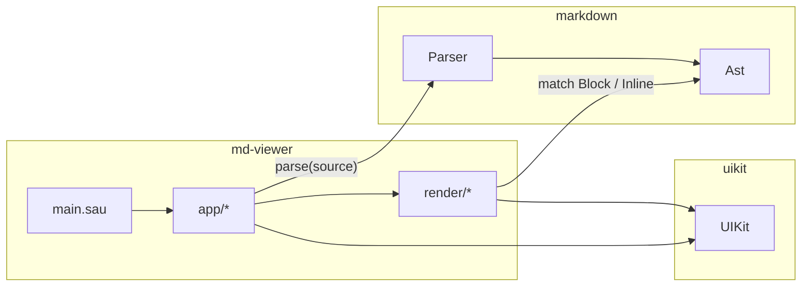
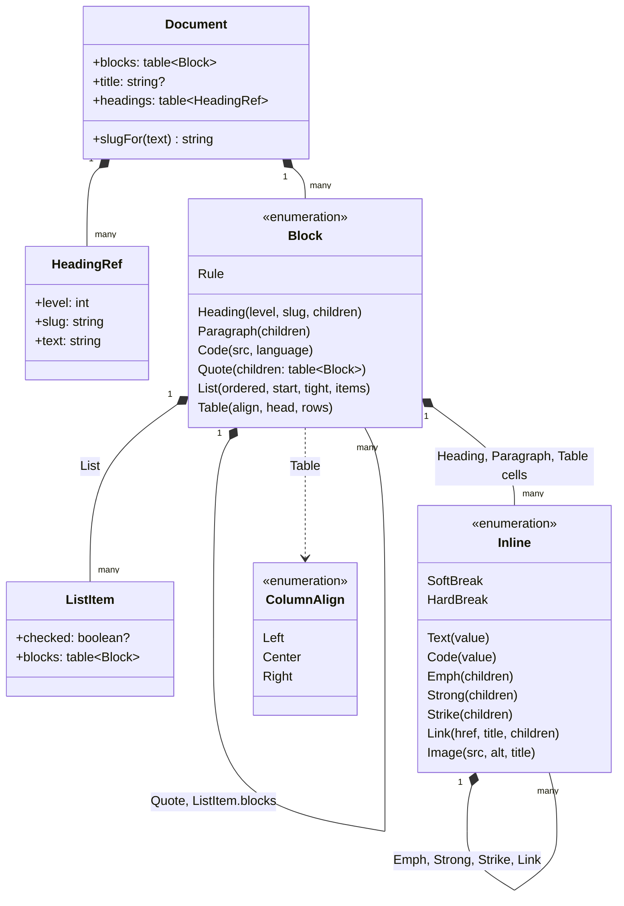
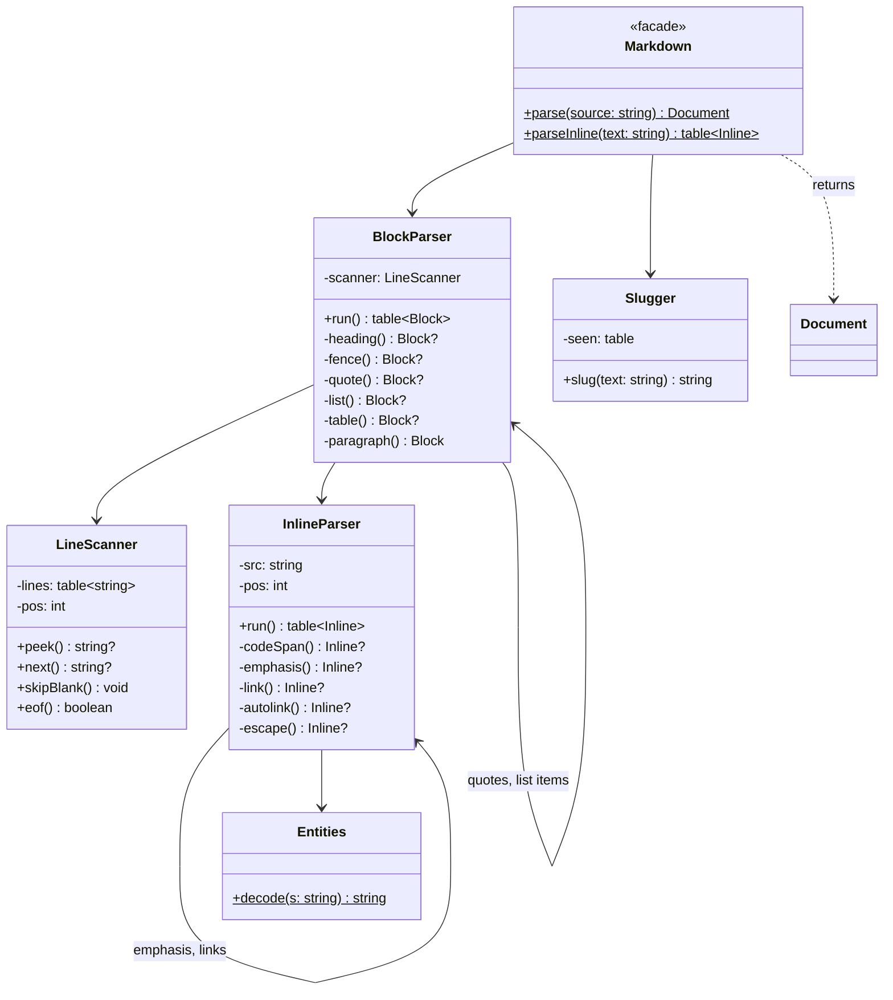
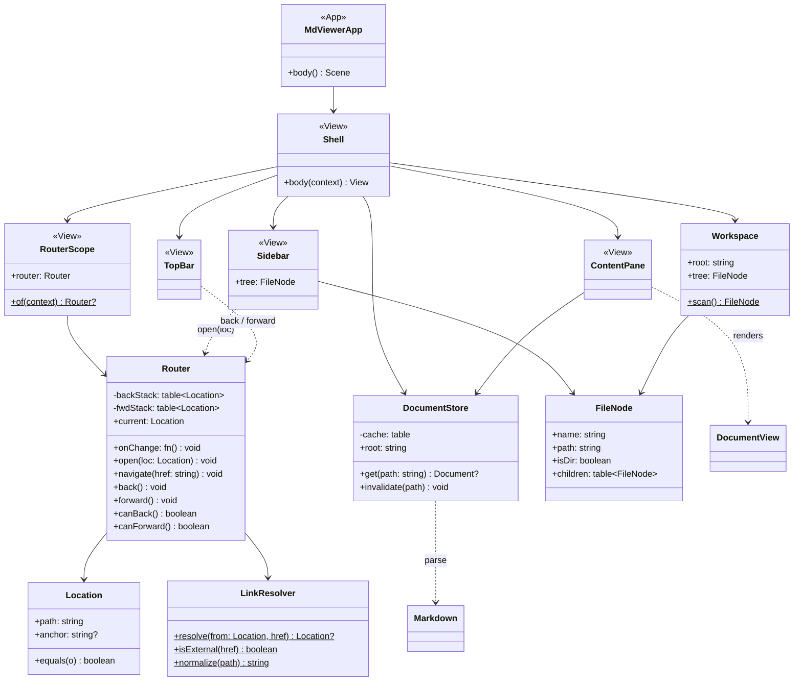
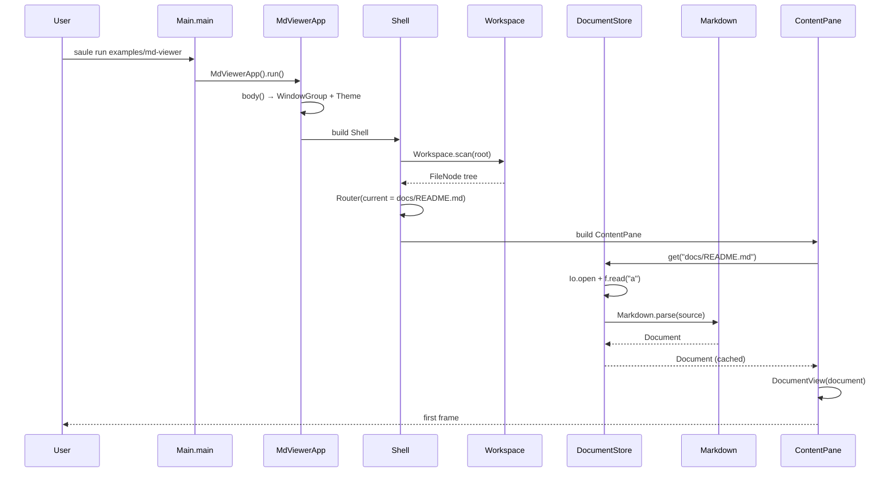
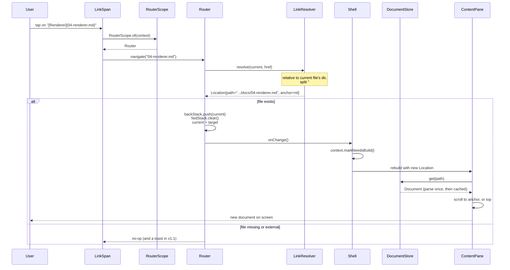
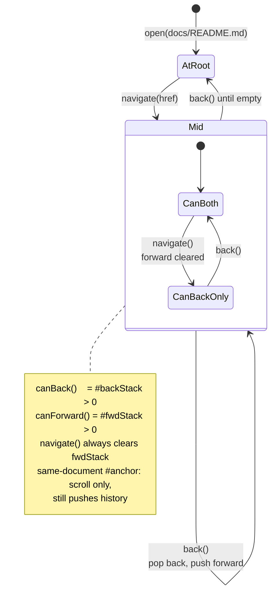

[← Scope](01-scope.md) · [Index](README.md) · [The markdown package →](03-markdown-package.md)

# 2. Architecture

The UML for md-viewer. Every box here becomes a real file; the file layout at
the [bottom of this page](#file-layout) maps them one to one.

- [Components](#components)
- [The AST](#the-ast) — `markdown` package
- [The parser](#the-parser) — `markdown` package
- [The renderer](#the-renderer) — app
- [The app shell](#the-app-shell) — app
- [Sequence: opening the app](#sequence-opening-the-app)
- [Sequence: clicking a link](#sequence-clicking-a-link)
- [State: history](#state-history)
- [Who owns what](#who-owns-what)
- [File layout](#file-layout)

---

## Components



Dependency rule, and the one thing to not get wrong:
**`markdown` never imports `uikit`, and never touches `Io` or `Os`.**
It is a string-to-tree function. That is what lets
[Milestone 1](06-build-order.md#milestone-1--blocks-headless) run the parser
before a window exists, and what makes the
[golden-file tests](07-testing.md#golden-files) possible at all.

---

## The AST

Defined in `markdown/src/Ast.sau`.



Both `Block` and `Inline` are **recursive through themselves** — a quote holds
blocks, strong text holds inlines. That recursion is why the
[renderer](04-renderer.md) is two mutually-plain recursive functions and
nothing more clever.

Why enums and not classes → [the reasoning](README.md#the-three-decisions-worth-knowing-up-front),
[the payload shapes](03-markdown-package.md#the-ast).

> **Naming hazard.** `Block.Table` shares a name with the stdlib `Table`
> module. It is always written qualified (`Block.Table(...)`,
> `case Block.Table(a, h, r)`), so it resolves — but if the typechecker
> complains inside `Ast.sau`, rename the variant to `TableBlock` and move on.
> Same story for `Inline.Text` versus UIKit's `Text` view, which collide only
> inside [`InlineRenderer`](04-renderer.md#inlinerenderer).

---

## The parser

Defined across `markdown/src/`.



`BlockParser` recurses into itself for quote bodies and list item bodies;
`InlineParser` recurses into itself for the contents of emphasis and links.
Every algorithm here is written out in
[The `markdown` package](03-markdown-package.md).

---

## The renderer

Defined in `md-viewer/src/render/`. This is the bridge: it is the only place
that imports both `markdown` and `uikit`.

```mermaid
classDiagram
    class DocumentView {
        <<View>>
        +document: Document
        +body(context) View
    }
    class BlockRenderer {
        +render(b: Block, style: MarkdownStyle)$ View
        +renderAll(bs, style)$ table~View~
    }
    class InlineRenderer {
        +runs(ins: table~Inline~, style, span: RunStyle)$ table~View~
    }
    class RunStyle {
        +bold: boolean
        +italic: boolean
        +mono: boolean
        +strike: boolean
        +color: Color
        +size: float
        +withBold() RunStyle
        +withLink(c) RunStyle
    }
    class MdTextStyle {
        <<extends TextStyle>>
        +face: Face
        +applyFont() void
        +withColor(c) MdTextStyle
        +withFace(f) MdTextStyle
    }
    class FontRegistry {
        +handle(face: Face, physical)$ int?
        +register(face, path)$ void
    }
    class MarkdownStyle {
        +h1..h6: float
        +body: float
        +codeSize: float
        +blockGap: float
        +linkColor: Color
        +codeBg: Color
        +from(theme: ThemeData)$ MarkdownStyle
    }
    class CodeBlockView {
        <<View>>
    }
    class MdTableView {
        <<View>>
    }
    class LinkSpan {
        <<View>>
        +href: string
    }

    DocumentView --> BlockRenderer
    DocumentView --> MarkdownStyle
    BlockRenderer --> InlineRenderer
    BlockRenderer --> CodeBlockView
    BlockRenderer --> MdTableView
    BlockRenderer --> BlockRenderer : quotes, list items
    InlineRenderer --> LinkSpan
    InlineRenderer --> RunStyle
    InlineRenderer --> InlineRenderer : nested emphasis
    RunStyle --> MdTextStyle : textStyle()
    MdTextStyle --> FontRegistry : applyFont()
    LinkSpan ..> Router : navigate(href)
```



The two renderers are **static functions, not views**. A view per AST node
would put a `body` between every `Strong` and its text, and UIKit's
[`ViewBuilder` claim rules](04-renderer.md#claiming) make that more delicate
than it is worth. Only the things that need state, layout or hit-testing —
`LinkSpan`, `CodeBlockView`, `MdTableView` — are real `View`s.

Bold and italic text needs no custom view at all. `Text.layout` and
`Text.paint` route every measurement and every draw through the style's
`applyFont`, which is public and virtual — so
[`MdTextStyle`](04-renderer.md#styled-runs-the-hard-part) overrides it to bind
a different face, and UIKit's own `Text` renders in that face unchanged.

Details: [The renderer](04-renderer.md).

---

## The app shell

Defined in `md-viewer/src/app/`.



Details: [The app shell](05-app-shell.md).

---

## Sequence: opening the app



The store reads the file, so [`DocumentStore`](05-app-shell.md#documentstore)
is the only component that touches `Io` — the parser stays pure and the views
stay ignorant of disk.

---

## Sequence: clicking a link

The feature this whole project exists for.



Two things in that flow are the ones that break in practice:

1. **`RouterScope.of` must find the router.** It walks up the element chain
   reading `data.scratch`, exactly like `Theme.of` walks up reading
   `data.theme`. If `RouterScope` is not an *ancestor* of the link, the lookup
   returns `nil` and clicks silently do nothing.
   → [App shell → Router](05-app-shell.md#router).
2. **`onChange` must mark the right element dirty.** Mutating the router does
   not repaint anything by itself. The `Shell` hands the router a closure that
   calls `markNeedsBuild` on the `Shell`'s own context.
   → [App shell → Rebuilds](05-app-shell.md#rebuilds).

---

## State: history



The rule that people get wrong: **a new navigation clears the forward stack.**
Back, then click something else, and "forward" must not offer the branch you
abandoned.

An `#anchor`-only jump within the current document is still a history entry —
back should return you to where you were reading.

---

## Who owns what

Lifetimes matter here, because UIKit rebuilds views constantly and keeps
elements. Anything holding state must live on the element side, not the view
side. See UIKit's own View/Element split in its README.

| Object | Lives on | Created | Survives rebuild? |
|---|---|---|---|
| [`Router`](05-app-shell.md#router) | `Shell` element state | once, in `Shell.body` via `context.state` | **yes** — this is the whole reason it goes in state |
| [`DocumentStore`](05-app-shell.md#documentstore) | `Shell` element state | once | yes; the parse cache must not be thrown away per frame |
| [`Workspace`](05-app-shell.md#workspace) / `FileNode` | `Shell` element state | once at startup, re-scanned on demand | yes |
| `Document` (AST) | `DocumentStore` cache, keyed by path | on first `get` | yes |
| `MarkdownStyle` | rebuilt per `DocumentView.body` | cheap, derived from `Theme.of(context)` | no, and should not |
| `RunStyle` | transient, per inline run | during render | no |
| Every `View` in `render/` | thrown away every rebuild | per frame | no — by design |
| Scroll offset | `ScrollController` in element scratch | by `ScrollView` | yes, **keyed per document** — see [ContentPane](05-app-shell.md#contentpane) |
| Font handles | `FontRegistry` statics | lazily per (face, physical size) | yes, process-wide cache |

The scroll-offset row is a real bug waiting to happen: give the content
`ScrollView` a `key` derived from the document path, or navigating to a new
file inherits the old file's scroll position.

---

## File layout

```
examples/
├── uikit/                          ✅ extracted from "UI Project"
│   ├── saule.config                  kind: "library"
│   └── src/ …                        29 files, unchanged from the original
├── markdown/                       ← the parser package
│   ├── saule.config                  kind: "library"
│   └── src/
│       ├── init.sau                  barrel — the package's public surface
│       ├── Ast.sau                   Block, Inline, Document, ListItem
│       ├── LineScanner.sau           line cursor with lookahead
│       ├── BlockParser.sau           lines → table<Block>
│       ├── InlineParser.sau          string → table<Inline>
│       ├── Entities.sau              &amp; and &#nn;
│       ├── Slugger.sau               heading text → anchor slug
│       └── Parser.sau                Markdown.parse facade
└── md-viewer/                      ← the app
    ├── saule.config
    ├── assets/                       fonts: regular, bold, italic, mono, icons
    ├── docs/                         these files — and the app's test corpus
    └── src/
        ├── main.sau                  MdViewerApp, Main.main
        ├── app/
        │   ├── Shell.sau             the three-region layout, owns the state
        │   ├── Router.sau            Router, Location
        │   ├── RouterScope.sau       ambient lookup, copied from Theme
        │   ├── LinkResolver.sau      href → Location
        │   ├── DocumentStore.sau     load + parse + cache
        │   ├── Workspace.sau         Workspace, FileNode, directory scan
        │   ├── Sidebar.sau
        │   ├── ContentPane.sau
        │   └── TopBar.sau
        └── render/
            ├── DocumentView.sau
            ├── BlockRenderer.sau
            ├── InlineRenderer.sau
            ├── MdTextStyle.sau       Face enum + the TextStyle subclass
            ├── RunStyle.sau
            ├── FontRegistry.sau
            ├── MarkdownStyle.sau
            ├── LinkSpan.sau
            ├── CodeBlockView.sau
            └── MdTableView.sau
```

Twenty-five source files. [Build order](06-build-order.md) creates them in the
order that keeps the thing runnable at every step.

---

[← Scope](01-scope.md) · [Index](README.md) · [The markdown package →](03-markdown-package.md)
