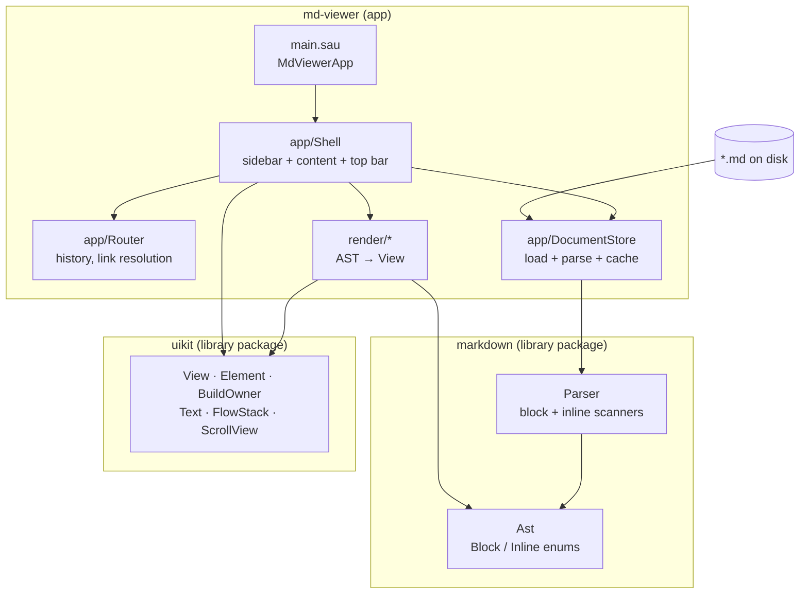

# md-viewer — design docs

A Markdown reader written in Saule, rendered with UIKit. Open a folder, pick a
file from the sidebar, read it — and click a `[link](other.md)` to go there,
with back and forward.

These docs are also the app's **test corpus**. The first document md-viewer
ever renders is this one, and the links below are the links whose navigation
you are building. When they work here, the feature is done.

---

## Read in this order

| # | Document | What it answers |
|---|---|---|
| 1 | [Scope](01-scope.md) | What v1 does, what it deliberately does not do |
| 2 | [Architecture](02-architecture.md) | **The UML.** Every class, who owns whom, what happens on a click |
| 3 | [The `markdown` package](03-markdown-package.md) | Text → AST. Parser design, algorithms, edge cases |
| 4 | [The renderer](04-renderer.md) | AST → UIKit views. Fonts, styled runs, tables |
| 5 | [The app shell](05-app-shell.md) | Window, sidebar, router, history, theme |
| 6 | [Build order](06-build-order.md) | **Start here to write code.** Ten milestones, each independently runnable |
| 7 | [Testing](07-testing.md) | Golden files, headless parser runs, differential VM/interp checks |

---

## The shape of it



Three projects, one direction of dependency:

- **[`markdown`](03-markdown-package.md)** is a pure library. It imports no UI,
  touches no filesystem, and can be exercised from a plain `saule run` script.
  This is the boundary that makes the parser testable.
- **`uikit`** is the toolkit, extracted out of `examples/UI Project` into a
  package so two apps can share it. **This already exists** — `UI Project` now
  depends on it and runs unchanged. See
  [Build order → Milestone 0](06-build-order.md#milestone-0--make-uikit-a-package).
- **`md-viewer`** is the app: it owns the window, the file tree, the history,
  and the [renderer](04-renderer.md) that turns one into the other.

---

## The three decisions worth knowing up front

**1. The AST is enums with payloads, not a class hierarchy.**
Saule has no downcasts. A `Block` base class with `Heading`/`Paragraph`
subclasses would leave the renderer holding a `Block`-typed value it cannot
inspect — the exact problem UIKit's README describes when explaining why it has
no `RenderObject` tree. `match` over an enum binds real typed payloads and the
typechecker enforces exhaustiveness, so adding a block kind produces a compile
error at every place that must handle it. → [Architecture](02-architecture.md#the-ast),
[details](03-markdown-package.md#the-ast).

**2. Styled inline runs need a font layer the toolkit does not have.**
`TextStyle` carries a colour and a size. That is all. Bold, italic and
monospace are *different faces*, and the engine loads a face with
`Graphics.newFont(size, path)`. So the renderer ships a small `FontRegistry`
and a `StyledText` view, and lays runs out with `FlowStack`.
→ [Renderer → Styled runs](04-renderer.md#styled-runs-the-hard-part).

**3. Link navigation is the app's own router, not UIKit's `Navigator`.**
UIKit's `Navigator` is an overlay route stack — push a modal, pop it. A
document viewer needs *addresses*: a path, an optional `#anchor`, a back stack
and a forward stack. That is a different object, reached the way `Theme` is
reached — an ambient value read back up the element chain.
→ [App shell → Router](05-app-shell.md#router).

---

## Running it

```bash
saule run examples/md-viewer
```

Once [Milestone 5](06-build-order.md#milestone-5--the-sidebar) lands, the app
opens on this folder. Until then each milestone has its own smaller way to see
that it works — that is the point of the ordering.

---

*Next: [Scope →](01-scope.md)*
